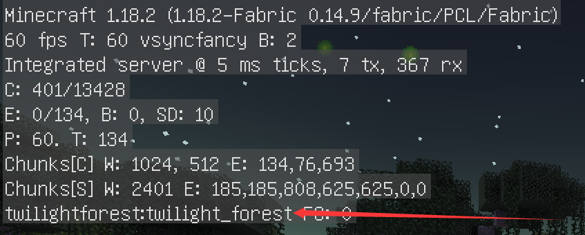
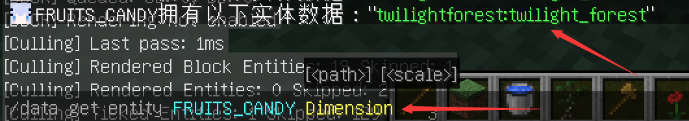

# Region_BackUp
一个以区域为单位备份或回档的MCDR插件
> [!TIP]
>
> 该文档尚未完善，文档正在编写中
>
> 尽可能的使用最新版本，以避免潜藏的问题
> 
> 发现bug先看看插件是不是有新版本，新版本大概率会修复问题
> 
> 升级版本后虽然配置文件能自动升级，但最好检查下
> 
> 发现问题请提交issue，如果您想为本项目做出贡献，欢迎提交pr
> 
需要 `v2.7.0` 以上的 [MCDReforged](https://github.com/Fallen-Breath/MCDReforged)

## 升级前需知
如果您是第一次使用使用本插件，你可以跳过这部分。

在您将插件升级到最新版本后(推荐这么做)，由于对自定义维度添加了支持。

不再局限于原版的三个维度，以及对spigot，paper一类将world拆分为多个世界的服务端提供了支持，因此备份文件夹的结构被改变。

为了保证1.8.4版本及之前创建的备份能够继续被使用，您需要运行!!rb update_slot指令来将备份升级到新格式以确保能继续使用。

## 用前需知
一个区域文件存储的范围被称为区域（Region），一个区域的大小是32×32区块。

本插件所能操控的最小单位为一个区域，即32x32区块，512x512范围的方块，因此在备份或回档时，最小范围为一个区域

坐标换算 区域x,z坐标=区块x,z坐标除32向下取整 区块x,z坐标=x,z坐标除16向下取整 区域x,z坐标=x,z坐标除512向下取整

本插件旨在提供一种新的备份回档方案，在使用时，应注意以下几点。

1.由于插件备份回档的范围为区域，因此在使用时，明明我只想备份5x5大小的区块，但备份了一个区域，这就导致备份了多余的范围，相应的，在回档时，这多余的范围也会跟着回档。

2.由于上一点，因此该插件产生的备份不建议长时间保存，以下为推荐插件使用场景：

（1）新建造好了机器，准备测试，服务器有可能因此频繁备份回档时。

（2）服务器在线玩家较多，某个区域正在进行机器测试等可能导致全服回档的操作，如果使用全局备份，回档会导致全体玩家进度还原，这时可以使用本插件，影响范围只针对几片区域。

（3）任何你只希望局部备份的地方。

 (4) 使用静态备份功能为某块区域内的建筑或机器提供长期备份，便于随时回档

3.插件目前有两种备份模式(动态备份，静态备份)，三种备份指令(半径备份，坐标备份，维度备份)，两种回档指令(槽位回档，撤回回档)，具体见指令说明。除维度备份外，实际使用时备份的范围往往会比你想要的大。

4.在v1.8.4版本插件新增了静态备份功能(即短时间内不会被替换的备份)，静态备份采用独立文件夹存储在./rb_static，与之相对的动态备份存储在./rb_multi，具体见指令说明。

5.在v1.9.1版本插件新增了多维度支持，原版环境下，0对应主世界，-1对应下界，1对应末地，在您的服务器有其他世界的情况下，您可以自定义一个整数来对应新的维度，这使得您的其他维度能够被插件识别，这个
整数与对应的维度名不能与其他维度的重复。

维度名不能随便填，一个不被minecraft承认的非法维度名将会导致插件无法获取玩家在使用!!rb make指令时所对应的维度，导致备份超时，要获取一个维度所对应的维度名有几种方法：

(1) 使用F3调试屏幕：在游戏中按下F3键，可以打开调试屏幕。在调试屏幕的左上角部分，可以看到当前所在维度的信息。



由此可知该玩家所在维度的合法维度名为twilightforest:twilight_forest

(2) 使用/data get entity 玩家id Dimension指令来获取玩家当前所在维度名



由此可知该玩家所在维度的合法维度名为twilightforest:twilight_forest

以下是一个添加其他维度的例子：

```
"dimension_info": {
        "-2": {
            "dimension": "twilightforest:twilight_forest",
            "world_name": "world",
            "region_folder": [
                "dimensions/twilightforest/twilight_forest/poi",
                "dimensions/twilightforest/twilight_forest/entities",
                "dimensions/twilightforest/twilight_forest/region"
            ]
        },
        "0": {
            "dimension": "minecraft:overworld",
            "world_name": "world",
            "region_folder": [
                "poi",
                "entities",
                "region"
            ]
        },
        "-1": {
            "dimension": "minecraft:the_nether",
            "world_name": "world",
            "region_folder": [
                "DIM-1/poi",
                "DIM-1/entities",
                "DIM-1/region"
            ]
        },
        "1": {
            "dimension": "minecraft:the_end",
            "world_name": "world",
            "region_folder": [
                "DIM1/poi",
                "DIM1/entities",
                "DIM1/region"
            ]
        }
```

由上例可知，-2与twilightforest:twilight_forest是新增加的一对维度,现在你也可以对该维度使用备份功能了！


6.由于插件在备份时会保存区域的方块数据、实体数据和兴趣点数据，因此可能会有玩家用此来刷取物品，因为插件只会备份与区域有关的数据，而不会与其他数据产生交互。

7.尽量不要在插件进行备份回档升级操作时重载插件。

8.备份时会在槽位里创建一个info.json文件，该文件存储着槽位的所有信息，请不要删除它，否则该槽位会被认定为无效槽位

9.如果在回档后你想撤销本次回档，你可以使用!!rb restore 指令，也可以在./rb_multi里的overwrite文件夹里将回档前的区域文件放到存档里的对应文件夹里来进行还原，注意在还原时不要忘记你想还原的是哪个维度的区域。

## 命令格式说明

`!!rb` 显示帮助信息

`!!rb make <区块半径> <注释>` 以玩家所在区块为中心,备份边长为2倍半径+1的区块所在区域

`!!rb make -s <区块半径> <注释>` 同上,只是创建的备份为静态备份(即永久备份)

`!!rb dim_make <维度:0主世界,-1地狱,1末地> <注释>` 备份给定维度的所有区域,维度间用,做区分 例 0 或 0,-1

`!!rb dim_make -s <维度:0主世界,-1地狱,1末地> <注释>` 同上,只是创建的备份为静态备份(即永久备份)

`!!rb pos_make <x1坐标> <z1坐标> <x2坐标> <z2坐标> <维度> <注释>` 给定两个坐标点，备份以两坐标点对应的区域坐标为顶点形成的矩形区域

`!!rb pos_make -s <x1坐标> <z1坐标> <x2坐标> <z2坐标> <维度> <注释>` 同上,只是创建的备份为静态备份(即永久备份)

`!!rb back <slot>` 回档指定槽位所对应的区域

`!!rb back -s <slot>` 同上,只是回档的对象为静态备份(即永久备份)

`!!rb restore` 使存档还原到回档前状态

`!!rb del <slot>` 删除某槽位

`!!rb del -s <slot>` 同上,只是删除的备份为静态备份(即永久备份)

`!!rb confirm` 再次确认是否回档

`!!rb abort` 在任何时候键入此指令可中断回档

`!!rb list <page>` 显示备份槽位信息

`!!rb list -s <page>` 同上,只是查看的备份为静态备份(即永久备份)

`!!rb update_slot` 将1.8.4版本及之前生成的备份升级到新版本

`!!rb reload` 重载插件

## 配置文件选项说明

配置文件为 `config/region_backup.json`。它会在第一次运行时自动生成

当你修改了配置文件后，记得输入!!rb reload来重载配置文件

### backup_path
默认值：`./rb_multi`
存储动态备份文件的路径

### static_backup_path
默认值：`./rb_static`
存储静态备份文件的路径

### word_path
默认值：`./server/world`
服务器存档的路径

### minimum_permission_level
默认值：`{
        "make": 1,
        "pos_make": 1,
        "dim_make": 1,
        "back": 2,
        "restore": 2,
        "del": 2,
        "confirm": 1,
        "abort": 1,
        "reload": 2,
        "list": 0
    }`
一个字典，代表使用不同类型指令需要权限等级。数值含义见[此处](https://mcdreforged.readthedocs.io/zh_CN/latest/permission.html)

把所有数值设置成 `0` 以让所有人均可操作

### slot
普通备份(即动态备份)的槽位数量
默认值：5
